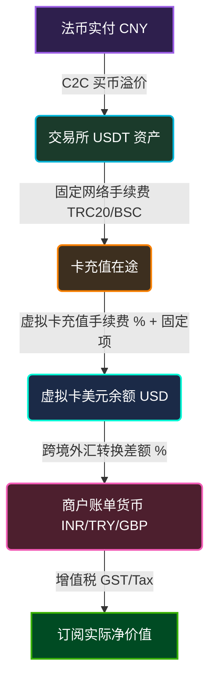

# RateXray 汇率透视镜 🔍

> **多链路海外支付成本与损耗审计工具**
>
> 帮助开发者与创业团队看透海外订阅（OpenAI/Claude/Midjourney 等）多重支付链条下的“隐性损耗”，辅助进行链路成本决策。

---

## 📖 项目简介

在订阅海外服务或进行境外跨境支付时，由于支付链条冗长且涉及多种中介，通常会产生较高的综合摩擦成本。例如：
$$\text{人民币法币 (CNY)} \xrightarrow{\text{C2C 溢价}} \text{交易所加密货币 (USDT)} \xrightarrow{\text{提币网络费}} \text{虚拟卡充值 (USD)} \xrightarrow{\text{跨境汇兑损耗}} \text{最终目标货币 (INR/GBP/TRY 等)}$$

**RateXray** 是一款纯前端实现的**海外多链路支付成本审计与预算测算工具**。它提供紧凑的水平可视化拓扑进度步进器与对称的数据看板，帮助用户认清每一分资金 of 损耗去向，从而做出合理的支付通道决策。

---

## 🌟 核心特性

- **📈 记账回溯审计 (Forward Audit)**
  - 导入历史实际支付的 CNY、OKX 获得币数、卡扣除 USD 及服务原币账单，一键还原该次交易在各环节被蚕食的费用明细与损耗。
- **🔮 预算购前估算 (Budget Planner)**
  - 在订阅前预先测算：输入目标价、税率和订阅席位，配合虚拟卡费率模板，系统可自动反推所需充值的 USDT 以及应付的 CNY 法币预算。
- **🟢 首屏完全零默认值冷启动 (Zero Default Values Clean Slate)**
  - 页面首次加载时不带入任何硬编码默认值，所有表单输入框保持空白，卡片预设处于未激活状态。
  - 通过高级动态占位符（Placeholder）提供直观的填报指引，并实现完善的零值保护机制，空白时看板呈清爽的零状态。
- **📊 水平支付链路步进器 (Horizontal Progress Stepper)**
  - 动态展示 `CNY` ➔ `USDT` ➔ `USD Card` ➔ `INR/TRY/GBP` 的价值流动。
  - 采用极简的透明圆形图标与下方居中排列的指标标签，将各步骤被蚕食的费用作为悬浮气泡直观呈现在水平连接线上。
  - 拥有加粗放大的高对比度箭头（18px 尺寸，2.8px 线宽），在深色背景下提供清晰的导向。
- **⚙️ 虚拟卡费率模板与自定义预设**
  - 内置主流虚拟信用卡品牌（如 Roogoo 卡、Dupay 卡、Fomepay 卡）的手续费率模板，支持一键加载参数与自定义调节。
- **🌐 实时参考汇率同步**
  - 自动对接开放汇率 API 获取实时官方汇率，支持在输入框留空时，将实时的 USD/CNY、USD/INR 等官方汇率作为底层计算基准。
- **🎨 现代暗黑拟物视觉与自适应单屏布局**
  - 采用 Outfit 与 Plus Jakarta Sans 字体，配以毛玻璃卡片（Glassmorphism）与优雅过渡。
  - 针对宽屏显示进行了自适应纵向和横向空间优化，两栏高度完美对齐，所有信息在单屏幕内完整展现，无任何滚动条。

---

## 📐 链路损耗数学模型 (Cost Friction Model)

RateXray 将每一笔交易的实际总人民币支出 $Total_{CNY}$ 拆解为以下五个部分，各部分的计算与分摊公式如下：

### 1. 订阅服务净价值 (Service Value)
$$Service_{CNY} = \frac{Price_{Target} \times (1 + Tax\%) \times Seats}{ExchangeRate_{USD/Target}} \times ExchangeRate_{USD/CNY(Official)}$$
*（在理想官方汇率、零手续费通道下，该订阅应付的人民币金额）*

### 2. OKX 买币溢价损耗 (OKX Premium Spread)
$$OKXPremium_{CNY} = Service_{USD} \times (Rate_{OKX(CNY/USDT)} - Rate_{Official(USD/CNY)})$$
*（交易所 C2C 商户售价与官方美元/人民币中间价之间的溢价磨损）*

### 3. 交易所提币手续费 (OKX Network Fee)
$$WithdrawalLoss_{CNY} = Fee_{Withdraw(USDT)} \times Rate_{OKX} \times \frac{USD_{Deducted}}{USD_{Credited}}$$
*（OKX 链上提币扣除的固定网络手续费在本次订阅金额中的分摊占比）*

### 4. 虚拟卡充值/手续费 (Card Deposit Fee)
$$DepositLoss_{CNY} = Loss_{Deposit(USD)} \times Rate_{OKX} \times \frac{USD_{Deducted}}{USD_{Credited}}$$
*（虚拟信用卡充值时，通道收取的百分比充值费及单笔固定手续费损耗）*

### 5. 卡跨境交易与外币汇兑费 (Card FX Spread)
$$FXLoss_{CNY} = (USD_{Deducted} - Service_{USD}) \times Rate_{OKX} \times \frac{USDT_{Got}}{USD_{Credited}}$$
*（非美元计价订阅触发虚拟卡的跨境外币交易费以及卡组织/发卡行结算汇差损耗）*

---

## 🔄 资金链路与损耗拓视图

通过以下 Mermaid 图表，可以清晰看到资金在各个节点流动时的费用关系：



---

## 🛠️ 文件结构

RateXray 为标准的无构建工具（Zero-Build）前端单页应用，文件结构非常精简，便于部署与集成：

```text
RateXray/
├── index.html        # 结构：页面布局、SVG 图标、表单项及交互骨架
├── style.css         # 样式：暗黑科技风设计系统、自适应单屏布局、毛玻璃及动效
├── app.js            # 逻辑：状态机管理、实时汇率 API 请求、核心计算模型与 DOM 驱动
└── img/              # 资源：项目所用图片与多尺寸图标
```

---

## 🚀 快速启动

由于该项目不依赖任何后端框架或打包工具，你可以通过以下任一方式运行：

1. **直接双击运行**：在文件浏览器中双击 `index.html`，即可在浏览器中直接打开使用（*注意：直接以 `file://` 协议打开时，可能会因跨域限制导致实时官方汇率获取失败，此时程序会自动启用内置的备用参考汇率*）。
2. **本地静态服务器（推荐）**：
   - 使用 VS Code 的 **Live Server** 插件一键启动。
   - 或者在项目根目录下通过终端使用 Python 快速托管：
     ```bash
     python -m http.server 8000
     ```
     然后访问 `http://localhost:8000`。
   - 或者使用 Node.js 的 `http-server`：
     ```bash
     npx http-server -p 8000
     ```

---

## 💡 链路优化实用建议

在使用 RateXray 审计后，您可以根据损耗指标采取以下策略降低交易成本：
1. **稀释固定提币费**：OKX 提币通常有固定的 $1 \text{ USDT}$ 左右的手续费。单次小额充值（如 $20 \text{ USD}$）会导致提币手续费占比高达 $5\%$ 以上。建议**单次大额充值**备用，以稀释固定费用。
2. **优选低跨境交易费卡种**：针对 INR、GBP 等非美金账单，如果虚拟卡收取的外币转换费偏高（超过 $1.5\%$），应尝试选择不收多币种转换跨境费的卡组织或卡段。
3. **选择买币低谷**：避开盘口紧张时段的 C2C 买币，在工作日交易相对平稳、USDT 价格贴近官方离岸汇率时分批入金。
